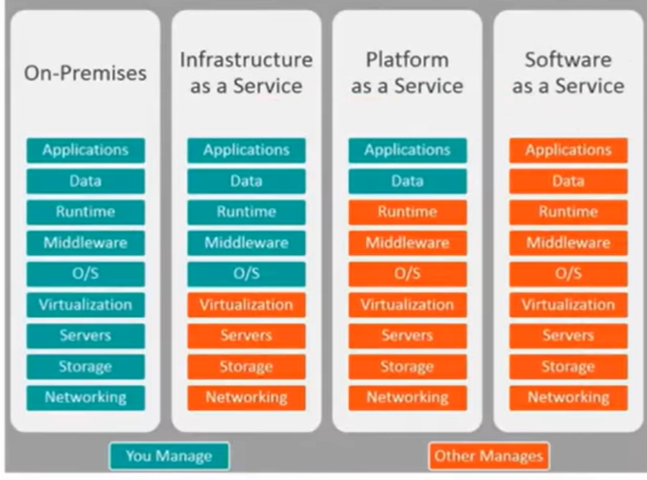

# Definição da Nuvem AWS e sua proposta de Valor

- **Computação em Nuvem:** Os servidores são 'alugados' sem a necessidade da minha gestão de hardware.
    - **Benefícios:**
        - **Alta disponibilidade**
        - **Confiabilidade**
        - **Segurança**
        - **Pago conforme uso**
        - **Escalabilidade** mais instancias
        - **Elasticidade** mais poder por instancia
        - **Sem necessidade de hardware previo**
        - **Economia de escala** A médida que você usa mais transferencia de dados, a AWS cobra menos.
- **Valor da Nuvem AWS**
    - Redução de Custos
    - Menos tempo configurando e mais produzindo
    - Resiliência operacional
    - Agilidade empresarial, pois se preocupa mais em criação
    - TCO:
        - Capex: Gasto com compra de hardware, para beneficios a longo prazo.
        - Opex: Gasto do dia a dia, para menter funcionando, operacional (Opex é o da Nuvem)
    - É possivel trazer as licenças compradas para Onprimess para a AWS.

- **Desing de Arquitetura Dentro da Nuvem**

- Redundancia, infraestrutura em diferentes availabilty zones.
- Serviços gerenciados, já tem serviços de recuperação.
- Desacoplar componentes (Usar microserviços).
- Arquitetura Elástica, aumentar e diminuir conforme necessidade.

# Segurança e Conformidade

- **Modelo de Responsabilidade compartilhada**

- *AWS* é responsável *pela* segurança da Nuvem
- *Cliente* é responsável *na* Nuvem

- Responsabilidades AWS
  - Proteger a Infraestrutura
  - Hardware, Software, rede e instalações

- **Conceitos de segurança e Conformidade da Nuvem AWS**

- Conformidade é estar de acordo com os padrões de segurança do mercado
- Criptografia na AWS:
    - As opções variam de acordo com cada serviço
    - Pode ter em repouso e em trânsito
    - **Amazon KMS: | KeyValut Azure**
        - É nativo em serviços
- Auditoria e Relatorio
    - **CloudTrail** Logs de Eventos dos usuarios
    - **CloudWhatch** É o azure monitor    

- Gestão de Usuarios:
    - Quanto menos privilegio melhor
    - Controle e Auditoria
    - IAM (O AD da aws):
        - SDK
        - Gerir usuarios
        - Controle de MFA
    - Conceitos:
        - USER
        - GROUPS
        - ROLES são usadas para aplicações também
        - POLICY uma ou mais regras
    - Conta RAIZ:
        - Não deve ser utilizada para tarefas diarias
        - Colocar MFA nela

- Serviços de Segurança
    - Amazon WAF
    - Network Acess List
    - Security Groups
    - AWS Makertplace
    - Trused Advisor

# Tecnologia:

- **Como provisionar recursos na Nuvem:**
    - SDK
    - CLI
    - Portal Web(Console)
    - Infra as Code
    - AWS CDK
    

- **Infraestrutura da aws**
    - Regiões (Elas contem os datacenters)
    - Zonas de disponibilidade (Conjunto de datacenters que se conectam em uma região)
    - Edge Locations (Locais com pequenos Setups para cahce de dados)
    - Disaster Recovery: Pelo menos 2 Zonas de disponibilidade:
        - Cenario onde tenho acessos globais, e preciso de baixa latência
        - Soberania de dados.