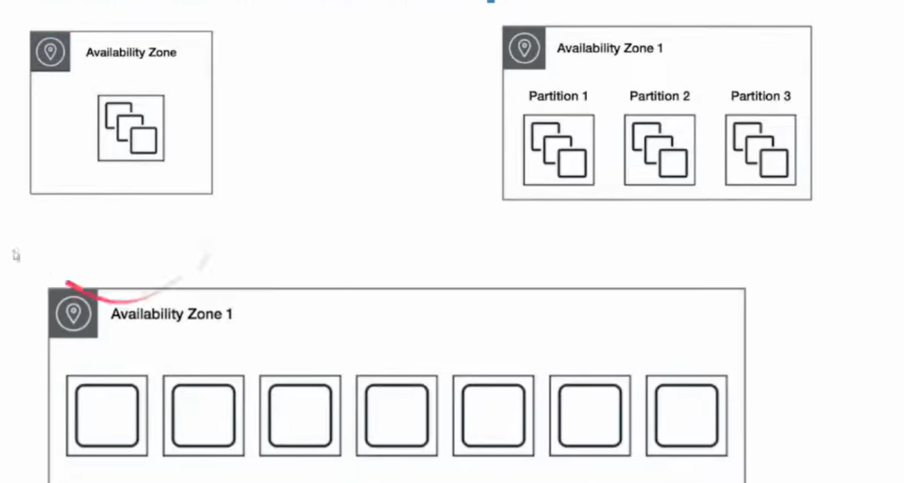

# Os Principais serviços da AWS:

## Serviços de Computação (Azure Equivalent)
- EC2 (Máquinas Virtuais)
    - Máquina Virtual
    - Diferentes modos de cobrança
        - Conforme Uso
        - Instâncias reservadas
        - Instancias SPOT
        - Host Dedicado (Não compartilha raque com outras empresas)
    - Configuração por nossa conta
    - Placement Groups (Organização de Instâncias):
        - Cluster: Instâncias mais proximas. Baixa Lâtencia
        - Partition: Divide instâncias em partições de tal forma que cada partição não divide o mesmo hardware. Workload Distribuidos
        - Spread: Divide instâncias de tal forma que cada partição não divide o mesmo hardware. Workload Critico.
        
        

    - Hardware:
        - Separado por familias. Exemplo: Familia M são de Uso geral, Familia T são pequenas para dev
        - Armazenamento:
            - Instance Store:
                - Termina Instancia os dados se perdem
            - EBS:
                - Instancia continua

- Lightsail
    - Facil de Configurar
    - Virtual Private Service
    
- ECS/EKS (Docker)
    - Ferramenta para orquestração de Containers
    - Orquestração Gerenciada pela AWS
    - AWS Copilot:
        - CLI especializada para ECS

- Auto Scaling:
    - Escalonamento Horizontal
    - Definimos regra para aumentar e reduzir as instâncias conforme necessário.
    - Launch Template: Permite Versionamento
    - Tipos de Escalonamento:
        - Manual
        - Dinâmico:
            - Target Tracking: "Quero que minhas máquinas fiquem em 70% de uso de CPU"
            - Step Scaling: Defino metricas.
            - Simple Scaling: Defino Metricas com Cooldown: "10 minutos em 90% de cpu aumenta uma máquina"
        - scheduled Scaling: Escalonamento planejado
        - Predictive Scaling: Machine Learning para prever o trafégo e assim escalar.

- LoadBalancer:
    - Application Load Balancer:
        - HTTP e HTTPS
    - Network Loadbalancer:
        - TCP, TLS , UDP
    - Gateway LoadBalancer:
        - IP

- Beanstalk (App Web)
    - Orquestrador Totalmente Gerenciado
    - Fácil Deploy de aplicações e Load Balancers

- Lambda (Function)
    - Serverless
    - Infraestrutura 100% gerenciada pela AES
    - Cold Starts (Demora um pouco pra iniciar)
    - Timeout máximo de 15 minutos

## Serviços de Armazenamento 

- S3:
    - Armazenamento de Objetos (Blob Storage)
    - Batch Operations - Envio de Grandes Cargas de Trabalho
    - Multipart Upload
    - Versionamento
    - Replicação Atraves de Regiões
    - Limite de Tamanho
    - É possivel usar o SDK, API REST, AWS CLI
    - Classes:
        - Standard (Hot)
        - S3 Glacier (Cold)
        - S3 Deep Archive(Archive Tier)

- AWS Snowball (Data Box)
    - Migração de dados em Peta Size

- EFS - Elastic File System
    - Armazenamento de arquivos compartilhados entre serviços

- AWS Storage Gateway
    - Conecta On-premisses para acessar os dados na nuvem

## Serviços de Rede

- VPC (VNET)
    - Define uma rede isolada dentro da AWS
    - Subnets
    - Route Tables Direciona as redes
    - Internet Gateway
    - VPC Peering, faz o pareamento entre redes
- Secutity Groups
    - Regras de Entrada e Saida
    - Associados às instâncias
- Amazon Route 53 (Azure DNS)
    - Mapeia Ips Para domínios
    - Tem politicas de Roteamento de DNS
- CloudFront (CDN)
    - Faz Cache dos contéudos
    - Videos on demand
- VPN
    - Site To Site | VPC com uma Rede privada
    - Client VPN | Acesso aos recursos de qualquer lugar
    - VPN Cloud HUB | Configurar varias vpns Site to Site
- Amazon Direct Connect
    - Conexão dedicada on-premisses nuvem
    - Não passa pela internet

## Serviços de Banco de dados

- RDS
    - Banco de Dados relacionais
    - Postgress, MySql, MARIADB, Oracle, SQL Server
    - Amazon Aurora: Engine MySql e PostGress
    - Aurora Serveless: Banco pausa após 5 minutos
- Dynamo (Cosmos DB)
    - Não relacional
    - Chave Valor
    - Tabelas e índices
    - É cobrado por escritas e leituras
- Amazon Redshift
    - Banco Colunar
    - Data Ware/Data Lake

## Suporte AWS

- 4 Niveis:
    - Basic
    - Developer
    - Business
    - Enterpise

- Configurar alertas de uso da conta
- Consultoria especializada
